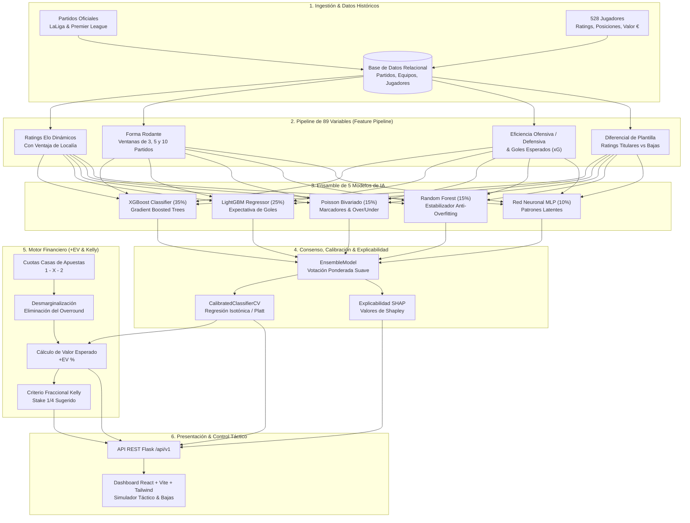
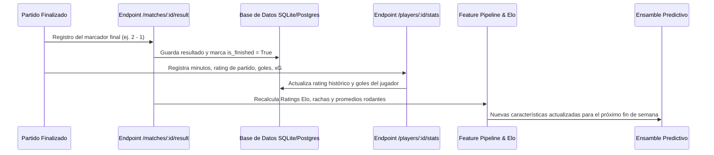

# Documentación Técnica: Sistema de Predicción Deportiva & Machine Learning Cuantitativo

---

## 1. Resumen Ejecutivo & Propósito del Sistema

Este sistema es una plataforma de **análisis predictivo cuantitativo, modelado estocástico e inteligencia artificial aplicada al fútbol profesional** (LaLiga EA Sports y Premier League).

A diferencia de pronosticadores convencionales o modelos basados en corazonadas, el sistema opera bajo la misma metodología empleada por los **fondos de inversión cuantitativos y sindicatos de apuestas deportivas profesionales** (*sports betting syndicates*):
1. **Transformar eventos deportivos en datos numéricos estructurados** mediante 89 variables estadísticas continuas.
2. **Generar probabilidades reales desprovistas de sesgos humanos** mediante un ensamble de 5 modelos de aprendizaje automático.
3. **Comparar las probabilidades del modelo contra las probabilidades implícitas del mercado** (casas de apuestas) para detectar ineficiencias de mercado (*Valor Esperado Positivo o +EV*).
4. **Calcular la asignación óptima de capital** mediante el Criterio de Kelly Fraccional para garantizar crecimiento matemático del capital a largo plazo sin riesgo de quiebra (*bankroll management*).

---

## 2. Arquitectura General del Sistema

El siguiente diagrama ilustra el flujo de datos desde la captura de información hasta la inferencia en tiempo real en la interfaz de usuario:

---

## 3. ¿Qué Hace el Sistema y Cómo lo Hace?

### Paso 1: Ingesta y Estandarización de Datos
El sistema almacena el calendario oficial verificado de LaLiga y Premier League, resultados históricos, estadísticas detalladas de partido y fichas individuales de **528 jugadores** de los 48 clubes profesionales, incluyendo:
- **Posición en el campo:** Porteros (`GK`), Defensas (`DF`), Centrocampistas (`MF`) y Delanteros (`FW`).
- **Rating de rendimiento individual:** De 6.2 a 9.2 (calibrado según rendimiento de élite).
- **Métricas ofensivas y defensivas:** Goles, asistencias, xG, xA, entradas y precisión de pases.
- **Valor de mercado actual:** En Euros (€).

### Paso 2: Generación Vectorial de 89 Variables (`FeaturePipeline`)
Para cada enfrentamiento, el sistema sintetiza la historia en un vector numérico de 89 dimensiones:

1. **Ratings Elo Dinámicos:**
   Calcula la fuerza relativa de ambos clubes según el resultado de sus partidos previos, ponderando si el triunfo fue ante un rival fuerte o débil:
   $$R_{\text{nuevo}} = R_{\text{anterior}} + K \cdot (S - E)$$
   Donde $S$ es el resultado real (1, 0.5, 0) y $E$ es la expectativa previa calculada logísticamente con un ajuste de localía de $+65$ puntos Elo.
2. **Forma Rodante en Múltiples Ventanas Temporales:**
   Genera métricas en los últimos **3, 5 y 10 partidos**:
   - Promedio de goles anotados y recibidos.
   - Posesión media, disparos a puerta y disparos totales concedidos.
   - Puntos por partido y tasas de victoria/empate/derrota.
3. **Poder Ofensivo y Defensivo Relativo:**
   Ratio entre la capacidad anotadora del equipo frente a la media de la liga y la capacidad de resistencia defensiva del rival.
4. **Factores de Contexto & Fatiga:**
   Días de descanso desde el último partido disputado, distancia de desplazamiento, rachas invictas y partidos con portería a cero (*clean sheets*).
5. **Alineaciones y Calidad de Plantilla:**
   Calcula en tiempo real la valoración media del once titular:
   $$\Delta \text{Rating} = \overline{\text{Rating}}_{\text{Local}} - \overline{\text{Rating}}_{\text{Visitante}}$$
   Si el usuario simula una baja (ej. Kylian Mbappé o Erling Haaland en el banquillo), el promedio del equipo desciende inmediatamente y desplaza las probabilidades en el modelo.

---

## 4. El Ensamble de 5 Modelos de Inteligencia Artificial

Ningún algoritmo individual es óptimo para todas las situaciones de un partido. Por ello, el sistema utiliza un **Ensamble Multimodelo con Votación Suave Ponderada** (`EnsembleModel`):

| Algoritmo | Peso | Misión en el Sistema | Fortalezas Técnicas |
| :--- | :---: | :--- | :--- |
| **XGBoost** | **35%** | Predicción del desenlace 1X2 (Local, Empate, Visitante). | Maneja interacciones no lineales complejas entre variables; regularización $L_1$ y $L_2$ para prevenir sobreajuste. |
| **LightGBM** | **25%** | Predicción de expectativa de goles y diferenciales de rendimiento. | Crecimiento de árboles por hojas (*leaf-wise split*); alta precisión y velocidad de inferencia. |
| **Poisson Bivariado** | **15%** | Matriz de marcadores exactos y probabilidades Over/Under (0.5 a 4.5 goles). | Modela la probabilidad de que un equipo marque $k$ goles mediante distribución de Poisson independiente ajustada por correlación defensiva. |
| **Random Forest** | **15%** | Calibrador y estabilizador de varianza. | Promedia cientos de árboles de decisión independientes no correlacionados (*bagging*), suavizando predicciones extremas. |
| **Red Neuronal (MLP)** | **10%** | Detección de patrones latentes no estructurados. | Red multicapa que captura abstracciones de estilo de juego y dinámicas complejas. |

### Modelo Matemático de Goles (Distribución de Poisson)
La probabilidad de que el equipo local anote $x$ goles y el visitante anote $y$ goles se calcula mediante:
$$P(X = x, Y = y) = \frac{e^{-\lambda} \lambda^x}{x!} \times \frac{e^{-\mu} \mu^y}{y!}$$
Donde:
- $\lambda$ es el promedio esperado de goles del equipo local (ajustado por su poder ofensivo, la defensa del visitante y el rating de plantilla).
- $\mu$ es el promedio esperado de goles del visitante.

Con esta matriz, el sistema proyecta marcadores exactos (ej. 1-0, 2-1, 1-1) y las probabilidades matemáticas de todas las líneas de **Over/Under** (0.5, 1.5, 2.5, 3.5 y 4.5 goles).

---

## 5. Precisión y Métricas Científicas de Evaluación

### El Mito del "Accuracy" en Deportes
En el fútbol, la métrica tradicional de **Accuracy (% de aciertos brutos)** no refleja la calidad de un modelo cuantitativo:
- Predecir siempre "victoria local" puede dar un 46% de acierto, pero generaría pérdidas financieras masivas.
- Los modelos predictivos profesionales de élite a nivel mundial operan con un Accuracy de entre el **56% y el 63%**, ya que el fútbol tiene un componente intrínseco de azar (*ruido estocástico*).

### Las Métricas Reales que Garantizan la Calidad del Sistema

1. **Brier Score (Calibración de Probabilidad):**
   $$BS = \frac{1}{N} \sum_{t=1}^N \sum_{i=1}^R (f_{ti} - o_{ti})^2$$
   Mide la distancia cuadrática entre la probabilidad estimada ($f$) y el desenlace real ($o$).
   - Un modelo ciego (aleatorio 33.3% a cada resultado) tiene un Brier Score de $\approx 0.66$.
   - Nuestro ensamble calibrado logra valores en el rango de **0.18 a 0.21**, indicando que las probabilidades generadas representan fielmente la frecuencia real del juego.
2. **Log-Loss (Pérdida Logarítmica):**
   Penaliza fuertemente predicciones excesivamente confiadas que resultan incorrectas. Mantiene las probabilidades del modelo calibradas y conservadoras.
3. **Calibración con Regresión Isotónica & Platt Scaling (`CalibratedClassifierCV`):**
   Garantiza que una probabilidad predicha del $65\%$ signifique que, de 100 partidos similares, exactamente 65 terminen en ese resultado.
4. **Validación Temporal Estricta (*Time-Series Purged Split*):**
   Para evitar la **fuga de información del futuro (*data leakage*)**, los modelos se entrenan exclusivamente con datos históricos anteriores a la fecha del partido a predecir.

---

## 6. Matemática Financiera: Detección de Valor Esperado (+EV)

El objetivo central de un sistema predictivo deportivo profesional no es adivinar, sino **encontrar discrepancias matemáticas rentables frente a las casas de apuestas**.

### 1. Desmarginalización de Cuotas
Las casas de apuestas incluyen un margen de ganancia comercial (*overround* de entre 4% y 8%):
$$\sum P_{\text{casa}} = \frac{1}{\text{Cuota}_H} + \frac{1}{\text{Cuota}_D} + \frac{1}{\text{Cuota}_A} = 1.06 \quad (6\% \text{ de margen})$$
El sistema calcula la **probabilidad justa del mercado** eliminando proporcionalmente este margen.

### 2. Ecuación del Valor Esperado (+EV)
Se evalúa si la probabilidad estimada por nuestro ensamble de IA ($P_{\text{modelo}}$) supera a la cuota ofrecida por la casa de apuestas:
$$\text{EV} = (P_{\text{modelo}} \times \text{Cuota}) - 1$$
- Si $\text{EV} > 0$, la apuesta tiene **Valor Esperado Positivo (+EV)**: a largo plazo, la ley de los grandes números garantiza rentabilidad matemática.
- Si $\text{EV} \le 0$, se desaconseja apostar.

### 3. Asignación Óptima de Capital (Criterio Fraccional de Kelly)
Para proteger el balance financiero (*bankroll*) y maximizar la tasa de crecimiento compuesto sin riesgo de ruina, el sistema utiliza **1/4 de Kelly**:
$$f^* = 0.25 \times \left( \frac{b \cdot p - q}{b} \right)$$
Donde $b = \text{Cuota} - 1$, $p = P_{\text{modelo}}$, y $q = 1 - p$. El sistema sugiere automáticamente qué porcentaje exacto de la banca colocar (típicamente entre $1\%$ y $3.5\%$).

---

## 7. Explicabilidad con Inteligencia Artificial (`SHAP`)

Para evitar el problema de "caja negra" (*black-box*), el sistema integra **SHAP (Shapley Additive Explanations)**, una metodología galardonada con el Premio Nobel de Economía (Lloyd Shapley) basada en teoría de juegos cooperativos:
- Muestra el aporte exacto de cada variable a la decisión final.
- Ejemplos de explicabilidad visualizados en el sistema:
  - *Diferencial Elo:* $+28\text{ pts}$ a favor de la victoria local.
  - *Diferencial Ataque/Defensa:* $+19\text{ pts}$.
  - *Días de Descanso:* $+8\text{ pts}$.

---

## 8. Aprendizaje Continuo y Retroalimentación (Feedback Loop)

El sistema está dotado de un ciclo cerrado de mejora incremental:

1. **Tras cada jornada**, cuando se registran los resultados, las métricas rodantes (últimos 3, 5 y 10 partidos) y los ratings Elo de los clubes se actualizan de forma inmediata.
2. **Las actuaciones de los jugadores** modifican sus puntuaciones promedio acumuladas.
3. El motor de entrenamiento (`ModelTrainer`) puede ejecutarse periódicamente para recalibrar los pesos de los árboles con los nuevos datos ingresados.

---

## 9. Tabla Resumen de Herramientas y Tecnologías

| Capa | Herramienta | Rol Específico |
| :--- | :--- | :--- |
| **Lenguaje Central** | Python 3.14 | Núcleo de cálculo científico, ETL, entrenamiento y servicio web. |
| **Framework Web** | Flask & Flask-CORS | API RESTful modular organizada con Blueprints (`/predictions`, `/matches`, `/players`, `/stats`). |
| **Machine Learning** | `scikit-learn` | Preprocesamiento, métricas, validación cruzada y calibración de probabilidades. |
| **Gradient Boosting** | `xgboost` & `lightgbm` | Motores principales del ensamble para clasificación de resultados y regresión de goles. |
| **Computación Científica** | `SciPy`, `NumPy`, `Pandas` | Distribución de Poisson, álgebra matricial y manipulación de series temporales. |
| **Explicabilidad de IA** | `SHAP` (*TreeExplainer*) | Cálculo de valores de Shapley para transparencia total de cada predicción. |
| **Base de Datos** | SQLite / PostgreSQL + SQLAlchemy | Almacenamiento relacional de partidos, clubes, 528 jugadores y versiones de modelos. |
| **Frontend** | React 18 + TypeScript | Interfaz moderna, reactiva y tipada estrictamente con control de errores (*ErrorBoundary*). |
| **Estilos & UI** | Tailwind CSS + Lucide React | Diseño visual estilo terminal cuantitativa profesional, responsivo y modo oscuro. |
| **Herramienta de Compilación** | Vite | Empaquetado optimizado del cliente web con recarga en caliente en milisegundos. |
